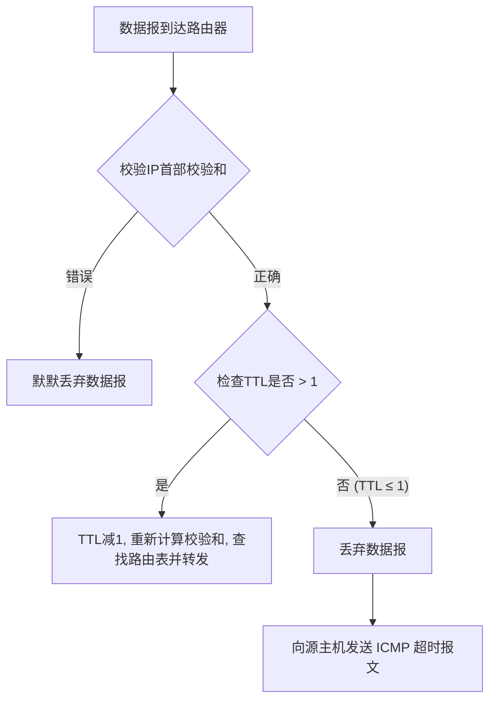

---
{"dg-publish":true,"dg-permalink":"/408/ICMP交警何时对IP数据报发出罚单呢🤔","permalink":"/408/ICMP交警何时对IP数据报发出罚单呢🤔/"}
---

ICMP差错报告报文是在IP数据报的转发或交付过程中发生错误（如目的不可达、生存时间为0等）时，由路由器或目的主机发送给源主机的。但是，当网络层发现IP首部校验和错误时，会立即丢弃该数据报，并不会发送任何ICMP差错报文。
### 一、ICMP差错报文的发送情况

当路由器或目的主机在处理一个IP数据报时，如果遇到无法继续处理的问题，就会生成一个ICMP差错报文，发送给该IP数据报的源主机。这个ICMP报文相当于一份“错误告知书”。

1. **终点不可达 (Destination Unreachable, 类型3)**：当路由器或主机无法交付数据报时发送。常见原因有：
    
    - **网络不可达** (代码0)：路由器找不到通往目的网络的路由。
        
    - **主机不可达** (代码1)：路由器找到了目的网络，但在该网络内找不到目的主机。
        
    - **协议不可达** (代码2)：目的主机的IP层收到了数据报，但其载荷应交付的运输层协议（如TCP/UDP）未在该主机上运行。
        
    - **端口不可达** (代码3)：数据报已到达目的主机，指定的协议也存在，但相应的端口号没有进程在监听。
        
    - **需要分片但DF位为1** (代码4)：路由器需要对数据报进行分片，但IP首部的“不分片(DF)”标志位被置为1。
        
2. **超时 (Time Exceeded, 类型11)**：
    
    - **TTL=0**：路由器收到一个IP数据报，发现其生存时间(TTL)字段为1或0。路由器将TTL减1后变为0，此时会丢弃该数据报，并向源主机发送ICMP超时报文。`traceroute`命令就利用了这个原理。
        
    - **分片重组超时**：目的主机在规定时间内没有收到一个被分片的数据报的所有分片，会丢弃已收到的分片，并向源主机发送此报文。
        
3. **参数问题 (Parameter Problem, 类型12)**：当路由器或目的主机发现IP首部中存在非法字段值或选项不完整等问题时，会丢弃该数据报并发送此报文。
    
4. **源点抑制 (Source Quench, 类型4)**：当路由器或主机由于拥塞而丢弃数据报时，向源点发送此报文，请求源点降低发送速率。**注意**：该报文在现在的互联网中已基本被弃用，被TCP的拥塞控制机制取代，但在考纲中仍可能作为历史知识点出现。
    
5. **重定向 (Redirect, 类型5)**：路由器发现一台主机使用了非最优的路径发送数据时，会向该主机发送重定向报文，告诉它下次应发往的“更近”的路由器。这要求主机和两个路由器在同一个局域网内。
    

### 二、IP首部校验和错误：为何是例外？

原因：

IP首部的校验和（Checksum）字段是用于保证IP首部完整性的。路由器每转发一个数据报，都要重新计算首部校验和。如果计算出的校验和结果不为0，就说明IP首部在传输过程中出现了比特差错，已经损坏。

一个损坏的IP首部是不可信的。其中最关键的字段，如**源IP地址和目的IP地址**，可能已经出错了。

- **如果源IP地址已经损坏**，那么ICMP差错报文将无法被正确地发送回真正的源主机，反而可能会被发送到一个无辜的、错误的地址，造成网络中不必要的垃圾流量。
    
- **如果目的IP地址已经损坏**，数据报本身就已经迷路了，讨论后续处理已无意义。
    

因此，协议设计者做出了最安全、最合理的规定：**一旦发现IP首部校验和有误，路由器或主机会立即“沉默地”丢弃该数据报，不做任何进一步处理，包括不发送ICMP差错报文。**

**流程图：路由器处理数据报的简化逻辑**

代码段

### 三、常考点分析与不发送ICMP的其它情况

除了IP首部校验和错误外，考研中还经常考察以下几种**不发送ICMP差错报文**的情况，必须牢记：

1. **对ICMP差错报文不再发送ICMP差错报文**：为了防止两个节点之间无限循环地发送ICMP差错报文，协议规定收到ICMP差错报文后即使发现它有问题，也不再为它生成新的ICMP差错报文。
    
2. **对第一个分片之后的分片不发送ICMP差错报文**：当一个数据报被分片后，只有第一个分片（片偏移为0）携带了完整的运输层首部信息（如TCP/UDP端口号）。如果后续分片出错，由于缺乏足够信息，且为了避免对同一个数据报的多个分片都发送差错报文而导致“ICMP风暴”，规定只对第一个分片出错时才发送ICMP报文。
    
3. **对具有多播或广播地址的数据报不发送ICMP差错报文**：向一个组或网络中的所有主机报告差错会导致网络流量的急剧增加（广播风暴），这是不被允许的。
    
4. **对作为链路层广播的数据报不发送ICMP差错报文**：这与上一条原理类似。
