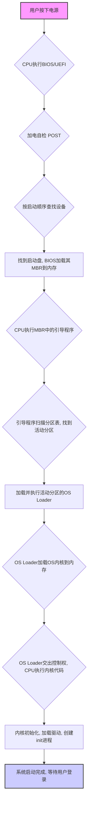

---
{"dg-publish":true,"dg-permalink":"/408/操作系统当中的引导程序","permalink":"/408/操作系统当中的引导程序/"}
---

### 二、引导过程详解 (Booting Process)
计算机的启动是一个“接力”过程，由一系列程序按顺序执行，前一个程序为后一个功能更强的程序准备好运行环境，并最终将控制权交给操作系统内核。整个过程可以分解为以下几个核心步骤：

#### 1. 硬件加电，执行BIOS/UEFI (固件阶段)
- **过程描述**：当你按下电源按钮，主板通电。CPU被重置，其内部的程序计数器(PC)被强制设置为一个预设的内存地址。这个地址指向主板上一块只读存储器(ROM)中的程序，这个程序就是**基本输入输出系统(BIOS)** 或其现代替代品**统一可扩展固件接口(UEFI)**。
- **核心功能**：
    - **加电自检 (POST, Power-On Self-Test)**：BIOS首先会对计算机的关键硬件（如CPU、内存、显卡、磁盘控制器等）进行检测，确保它们能正常工作。
    - **初始化硬件**：对硬件进行一些基本的初始化设置。
    - **查找并加载引导程序**：BIOS会根据预设的启动顺序（如硬盘 -> U盘 -> 光驱）去检查存储设备的第一个扇区。

#### 2. 加载并执行主引导记录 (MBR)
- **过程描述**：BIOS在找到一个可启动的磁盘后，会读取该磁盘的**第一个扇区（0磁道0柱面1扇区）**，这个扇区被称为**主引导记录 (Master Boot Record, MBR)**。然后，BIOS将这512字节的内容完整地加载到内存的一个约定好的地址（通常是 `0x7C00`）。最后，BIOS会通过一条跳转指令，将CPU的控制权交给这段刚刚加载到内存的代码。
- **MBR结构 (重要考点)**：一个标准的MBR扇区大小为512字节，其结构如下：
    - **主引导程序 (Bootloader)**：占大约446字节，这是我们通常所说的**引导程序**。它的代码非常精简。
    - **磁盘分区表 (Partition Table)**：占64字节，描述了磁盘上的分区信息（如哪个是活动分区）。
    - **结束标志 (Magic Number)**：占2字节，必须为 `55AAH`。BIOS通过检查这个标志来确认这是否是一个有效的MBR。
- **核心功能**： MBR中的引导程序功能非常单一，因为它太小了。它的核心任务是：**利用分区表找到“活动分区”（即操作系统所在的分区），然后加载并执行该活动分区中的另一个更强大的加载程序（有时称为“分区引导记录”或“操作系统加载程序”）。**

#### 3. 加载并执行操作系统加载程序 (OS Loader)
- **过程描述**：MBR中的引导程序将控制权交给活动分区中的操作系统加载程序（例如Windows的 `bootmgr` 或Linux系统中的GRUB第二阶段加载程序）。
- **核心功能**：这个加载程序比MBR中的引导程序强大得多。它通常**具备识别文件系统的能力**。它的核心任务是：
    - 在文件系统中找到并读取操作系统的**内核文件**（例如Linux的 `vmlinuz`、Windows的 `ntoskrnl.exe`）。
    - 将内核文件完整地加载到内存中。

#### 4. 加载并启动操作系统内核
- **过程描述**：操作系统加载程序在完成内核加载后，会将CPU的控制权彻底交给内存中的内核代码的入口点。
- **核心功能**：从这一刻起，**操作系统正式开始启动**。内核会接管所有硬件控制权，并执行以下操作：
    - **自身初始化**：建立内核所需的数据结构（如进程表、内存管理表等）。
    - **硬件驱动加载**：探测并加载系统中所有硬件的驱动程序。
    - **创建初始进程**：创建操作系统的第一个用户态进程（在类Unix系统中通常是 `init` 或 `systemd` 进程），此进程是所有其他用户进程的祖先。
    - **启动系统服务，等待用户登录**：启动各种后台服务，最终进入我们熟悉的登录界面或命令行。

---

### 三、流程图
为了更清晰地理解这个“接力”过程，请看下面的流程图：

代码段

---

### 四、常考点分析、命题方式与陷阱
1. **概念辨析（选择题）**
    
    - **陷阱**：混淆BIOS和引导程序。BIOS是固化在主板上的固件，它的**作用是加载第一个引导程序(MBR)**，但它本身不是我们通常意义上讨论的、位于硬盘上的引导程序。
    - **考点**：MBR的结构和作用。题目会问MBR的大小（512B）、结束标志（`55AAH`）、包含的内容（引导代码+分区表）。会考察MBR引导程序的核心功能是加载下一个加载程序，而不是直接加载内核。
2. **流程排序（选择题/综合题）**
    
    - **命题方式**：给出一系列事件，要求按正确的时间顺序排列。例如：①加载内核 ②执行POST ③加载MBR ④执行init进程。正确顺序为 ② -> ③ -> ① -> ④。
    - **陷阱**：注意区分**程序**和**进程**。在内核完全启动并创建第一个进程（如init）之前，整个引导过程中执行的代码（BIOS、MBR、OS Loader）都只是**程序**，还不存在操作系统“进程”这个概念。进程是操作系统创建并管理的概念。
3. **位置辨析（选择题）**
    
    - **考点**：BIOS存在哪里？（主板ROM芯片）。MBR存在哪里？（启动磁盘的第一个物理扇区）。内核文件存在哪里？（磁盘特定分区的文件系统中）。它们最终被加载到哪里去执行？（RAM/内存）。

---

### 五、边界情况与易错点
1. **用户态与核心态**：在整个引导过程中，直到操作系统内核完全接管之前，CPU通常运行在**实模式**或**保护模式**下，但始终处于最高权限级别，可以执行任何指令。进入核心态/用户态的划分，是操作系统内核建立起来的概念。内核本身的代码运行在**核心态**。

2. **引导失败**：如果在任何一个环节出错（如POST失败、找不到启动设备、MBR损坏、内核文件丢失），计算机会停机并显示相应的错误信息，例如 "Operating System not found"。

